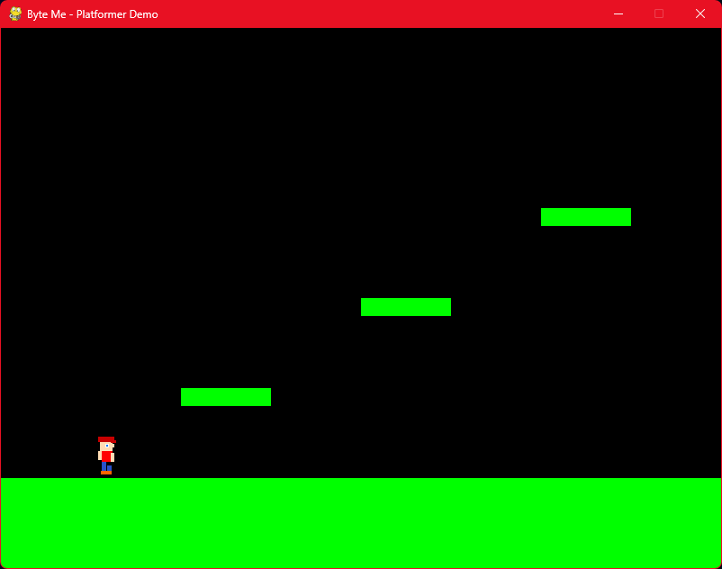

# Mario-Style Side-Scrolling Game

A simple side-scrolling platformer game built with Python and Pygame.

## Features

- Player character that can move left/right and jump
- Platforms to jump on
- Moving enemies
- Side-scrolling camera that follows the player
- Gravity and collision detection

## Requirements

- Python 3.x
- Pygame

## Installation

1. Install Python from https://python.org
2. Install Pygame: `pip install pygame`
3. Run the game: `python main.py`

## Controls

- Left Arrow: Move left
- Right Arrow: Move right
- Space: Jump

## Modifying the Game

The game is structured with classes for Player, Platform, and Enemy. You can modify:

- Add more levels by changing the platforms and enemies lists
- Add sprites/images instead of colored rectangles
- Add sound effects and music
- Implement scoring, lives, or power-ups
- Add more enemy types or behaviors
- Improve collision detection

## Troubleshooting

- If the game doesn't run, ensure Pygame is installed: `pip install pygame`
- On some systems, you may need to install additional dependencies for Pygame